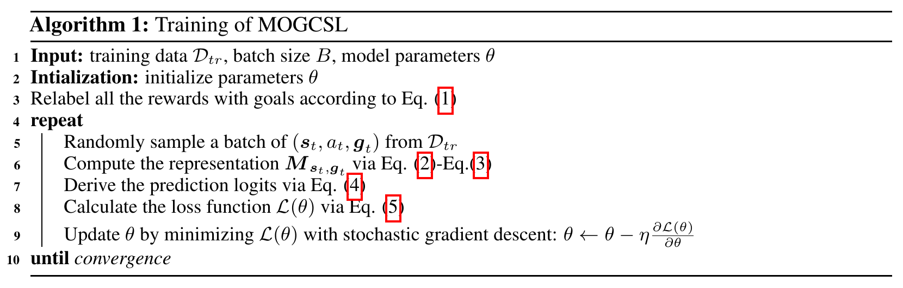
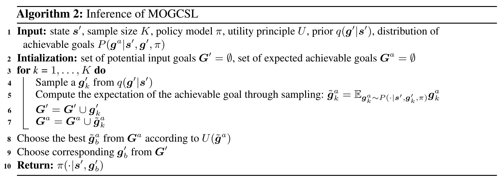

# MOGCSL: Goal-Conditioned Supervised Learning for Multi-Objective Recommendation

[](https://arxiv.org/pdf/2412.08911)


This repository provides the official implementation of MOGCSL, accepted at **NeurIPS 2026**.

MOGCSL learns to optimize multiple recommendation objectives from offline sequential data by conditioning predictions on multi-dimensional goals. It uses a simple supervised learning framework to reduce the influence of noisy interactions and select desirable, achievable goals for inference.

<p align="center">
  
  
</p>

## Structure

- `Challenge15/`: MOGCSL and MOPRL experiments on Challenge15.
- `RetailRocket/`: MOGCSL and MOPRL experiments on RetailRocket.
- `Baselines/`: multi-task recommendation baselines with separate [setup instructions](Baselines/README.md).

## Installation

The code was tested with Python 3.7.1.

```bash
conda create -n GCSL python=3.7.1
conda activate GCSL
pip install torch==1.0.1 torchvision==0.2.2 -f https://download.pytorch.org/whl/torch_stable.html
pip install -r requirements.txt
conda install cudatoolkit==10.0.130 cudnn==7.6.5
```

## Running

Run the following commands from either `Challenge15/` or `RetailRocket/`, using the bundled `data/` directory. For example:

```bash
cd RetailRocket

# Train and evaluate MOGCSL
python SASRec_GSL.py --data data

# Train and evaluate MOPRL
python SASRec_PRL.py --data data
```

## Reference

Please cite our [paper](https://arxiv.org/pdf/2412.08911) if you use this code.

```bibtex
@inproceedings{li2026mogcsl,
  title={Goal-Conditioned Supervised Learning for Multi-Objective Recommendation},
  author={Li, Shijun and Hasson, Hilaf and Hu, Jing and Ghosh, Joydeep},
  booktitle={Advances in Neural Information Processing Systems},
  year={2026}
}
```